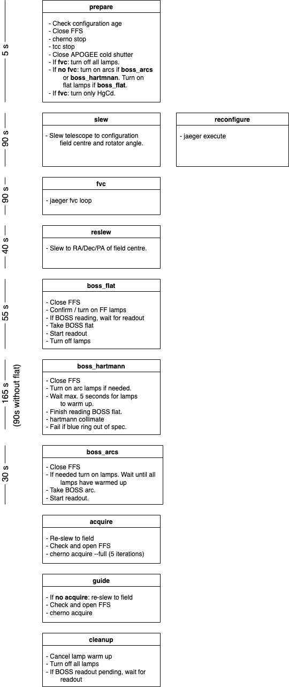

.. _hal-macros:

Macros
======

Introduction
------------

Macros are defined as a procedure that is composed of a series of nuclear steps, or *stages*. Stages can be run concurrently and the list of stages that run with a macro can be customised by the user.

There are three distinct types of stages:

- *Precondition* stages. These stages always run before the normal stages. A precondition stage cannot run concurrently with other preconditions. Precondition stages are mostly intended to prepare the system for the stages ahead (e.g., turn on lamps, open shutters, etc.)
- *Normal* stages. These form the bulk of the macro and can be run concurrently. Each stage should represent a well defined part of the macro procedure. Examples of stages are slewing the telescope to a field, taking a BOSS arc, etc.
- *Cleanup* stages. These stages always run at the end of the macro or if the macro fails at any point. Their purpose is to leave the system in a safe condition regardless of the result of the macro execution. Cleanup stages cannot run concurrently.

Macros are defined as a subclass of the `.Macro` base class, with each stage a coroutine method in the class with a name that matches the stage. A minimal example is ::

    class ExposeMacro(Macro):
    """Takes a science exposure with APOGEE and/or BOSS."""

    name = "expose"

    __PRECONDITIONS__ = ["prepare"]
    __STAGES__ = [("expose_boss", "expose_apogee")]
    __CLEANUP__ = ["cleanup"]

    async def prepare(self):
        """Prepare for exposures and run checks."""

        ...

    async def expose_boss(self):
        """Exposes BOSS."""

        ...

    async def expose_apogee(self):
        """Exposes APOGEE."""

        ...

    async def cleanup(self):
        """Cancel any running exposures."""

        ...

Note that in this example ``expose_boss`` and ``expose_apogee`` run concurrently, which is specified by listing both stages in the ``__STAGES__`` attribute as a tuple.

.. _macro-goto-field:

Go to field
-----------

The following diagram shows the stages in the `.GotoFieldMacro` macro. Note that the durations for each stage may change depending on the stages that are actually selected to run. The indicated durations assume that all the stages are selected.

.. _macro-expose:

Expose
------

The `hal expose <.ExposeMacro>` macro provides the logic to expose the APOGEE and BOSS spectrographs simultaneously for science exposures. It's composed of four stages:

- `~.ExposeMacro.prepare` does a series of sanity checks and prepares the system. If APOGEE is being exposed, opens the cold shutter (and optionally the FPI one) and if needed adjust the APOGEE dither position. If the FFS are closed it opens them.
- `~.ExposeMacro.expose_boss` exposes the BOSS spectrograph for a number of exposures.
- `~.ExposeMacro.expose_apogee` exposes the APOGEE spectrograph and contains the most complicated logic to support dither pairs and to match the BOSS exposure time. If both ``expose_boss`` and ``expose_apogee`` are enabled (the default), the stages run concurrently.
- `~.ExposeMacro.cleanup` is only relevant if the macro fails while starting an exposure. In that case it aborts any running exposures and cleans the system.

The list of available options, with default values, for ``expose`` is:

..  code-block:: yaml

    boss_exposure_time: 900.
    apogee_exposure_time: null
    count: 1
    count_apogee: null
    count_boss: null
    apogee: true
    boss: true
    pairs: true
    disable_dithering: false
    initial_apogee_dither: null
    with_fpi: true
    no_readout_match: false

For reference on how to use these options with the ``hal expose`` command, refer to the :ref:`actor documentation <actor-commands>` or do ``hal expose --help``.

By default the command will expose both APOGEE and BOSS. To avoid exposing one of them you'll need to pass ``--no-apogee`` or ``--no-boss`` when calling the command. This is equivalent to choosing only the ``expose_apogee`` or ``expose_boss`` stages. The ``--count`` parameter always refers to full exposures for BOSS. For APOGEE the count refers to *dither pairs* if ``--pairs`` (the default) or to single exposures if ``--no-pairs``. By default if ``--count`` is greater than zero the dither position will change between exposures (while attempting to minimising moves). Some examples (all assume the APOGEE dither mechanism is at ``A``):

- ``hal expose --count 1`` will expose BOSS for 900 seconds and in the meantime it will take two APOGEE exposures with dither sequence ``AB``.
- ``hal expose --count 2`` will take two BOSS exposures of 900 seconds and two APOGEE dither pairs for a full sequence ``ABBA``.
- ``hal expose --count 2 --no-pairs`` will take 2x900 seconds for BOSS and two APOGEE exposures ``AB``.
- ``hal expose --count 2 --no-pairs --disable-dithering`` will take 2x900 seconds for BOSS and two APOGEE exposures without modifying the dither position (``AA``).

It is possible to pass an exposure time to APOGEE, in which case that will be the exposure time used. Note that *the exposure time always refers to a single exposure* but the total exposure time will depend on whether ``--pairs`` (the default) is used or ``-no-pairs``. For example, ``hal expose --no-boss --count 3 --apogee-exposure-time 300 --no-pairs`` will take 3x300 seconds exposures but ``hal expose --no-boss --count 3 --apogee-exposure-time 300`` will take 6x300 seconds (three dither pairs).

Most commonly, the exposure time for APOGEE is calculated to match the BOSS exposure time (if BOSS is being exposed). Here's where things get a bit complicated. If taking a single BOSS exposure, ``hal expose`` will calculate the APOGEE number of reads so that the APOGEE exposures (single or dither pair) finish as the BOSS readout begins. This allows to do something else during the readout, such as slewing, folding the FPS, etc. However, if multiple exposures are taken back to back, the APOGEE exposure time will be the BOSS exposure time plus overheads *except for the last exposure/dither pair*.

The readout time for BOSS is estimated to 63 second, and flushing is 17 seconds. With this, if one executes ``hal expose --count 2 --boss-exposure-time 900``, BOSS will take two 900-second exposures. APOGEE will take four exposures (two dither pairs) with the following exposure times:

- The first exposure (dither position ``A``) will expose for 490 seconds (this is :math:`\frac{1}{2}(17+900+63)`).
- The second exposure (dither ``B``) will also be 490 seconds for a total of 980 seconds. At this point the first BOSS exposure has finished reading out.
- The third exposure (dither ``B``) will be 459 seconds, which is the ceil of :math:`\frac{1}{2}(17+900)` (the same as before but without the readout time).
- The fourth exposure (dither ``A``) will also be 459 seconds. At the end of the last APOGEE exposure the second BOSS exposure is starting to read.

If only APOGEE is exposed without passing an exposure time (``hal expose --no-boss``), the APOGEE exposure time is still :math:`900+63+17=980`.

This is the desired behaviour during science operations but it can be overridden by passing a specific APOGEE exposure time. For example ::

    hal expose --count 2 --boss-exposure-time 900 --apogee-exposure-time 500

will take two 900 seconds BOSS exposures and 4x500 seconds APOGEE exposures.

It's also possible to specify the APOGEE exposure time as number of reads, e.g., ``hal expose --no-boss --reads 40`` will take a dither pair with each exposure taking 424 seconds approximately.

While the macro is exposing, a series of keywords are output indicating the current exposure, total number of exposures, and estimated remaining time. For example, if ``hal expose --count 2`` is executed one should see the sequence of keywords::

    exposure_state_boss=1,2,1960
    exposure_state_apogee=1,4,T,A,1898
    exposure_state_apogee=2,4,T,B,1408
    exposure_state_boss=2,2,980
    exposure_state_apogee=3,4,T,B,918
    exposure_state_apogee=4,4,T,A,459

The ``exposure_state_boss`` keys are the current exposure, the total number of exposures, and the estimated remaining time. The ``exposure_state_apogee`` keys are the current exposure, the total number of exposures, whether we are doing dither pairs, the dither position for the current exposure, and the estimated remaining time. Compare this with the case in which we do ``hal expose --count 2 --no-pairs`` when we'd see ::

    exposure_state_boss=1,2,1960
    exposure_state_apogee=1,2,F,A,1898
    exposure_state_boss=2,2,980
    exposure_state_apogee=2,2,F,B,918
